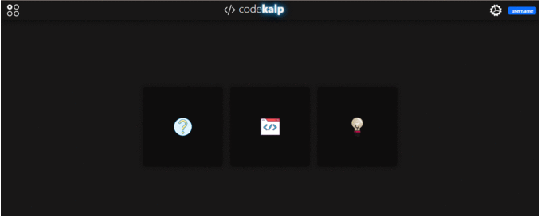

<h1 style="text-align:center;">codekalp</h1>

code __kalp__ is a social media to share our programming codes as post and it will be helpful for the programmers who can share their programming codes and ideas to people by posting it in *code**kalp***

# **Built with**

* __Frontend__
  * HTML
  * CSS
  * Bootstrap
  * Javascript & Jquery

* __Backend__
  * Python [Flask Framework]
* __Database__
  * SQL Server Management Studio
* __Tools__
  * Highlightjs
    * To highlight the syntax
  * Codemirror
    * To create a text editor

## Modules in code**kalp**
* __POST__
* __QUESTION__
* __ANSWER__

### __POST__ :
>    In this Post module users can share their codes after sharing these posts can be seen by anyone who is having an account in code**kalp**.It has been featured with *like*,*share* and *comment*

### __QUESTION__ :
> This module will be having your error codes or doubt codes when your post your error codes in this module,the error codes will be corrected or clarified by any one who is having account in codekalp.

### __ANSWER__ :
> whatever the questions or error codes which has been posted in this module will be displayed and if any questions are answered will be shown here.

## user manual :

**Step-1**
 * create an account by signing up with your **email** one email may have many accounts
 * > Note : *the __username__ must be unique*

**step-2**
 * After create an account you will be redirected towards the **create profile** page you may choose the desired image as you want and user bio will be optional.

 **Step-3**
 * You must login with the user name and password that you have created in signup

 **Step-4**
 * After Log in You can make use of which module you want

*these are all the various navigations that you can perform with*

As this has been built in my local server so It couldn't be hosted

